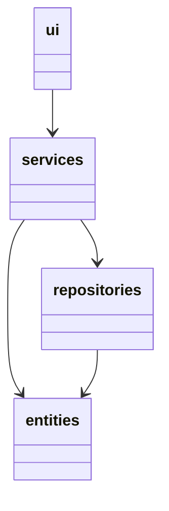
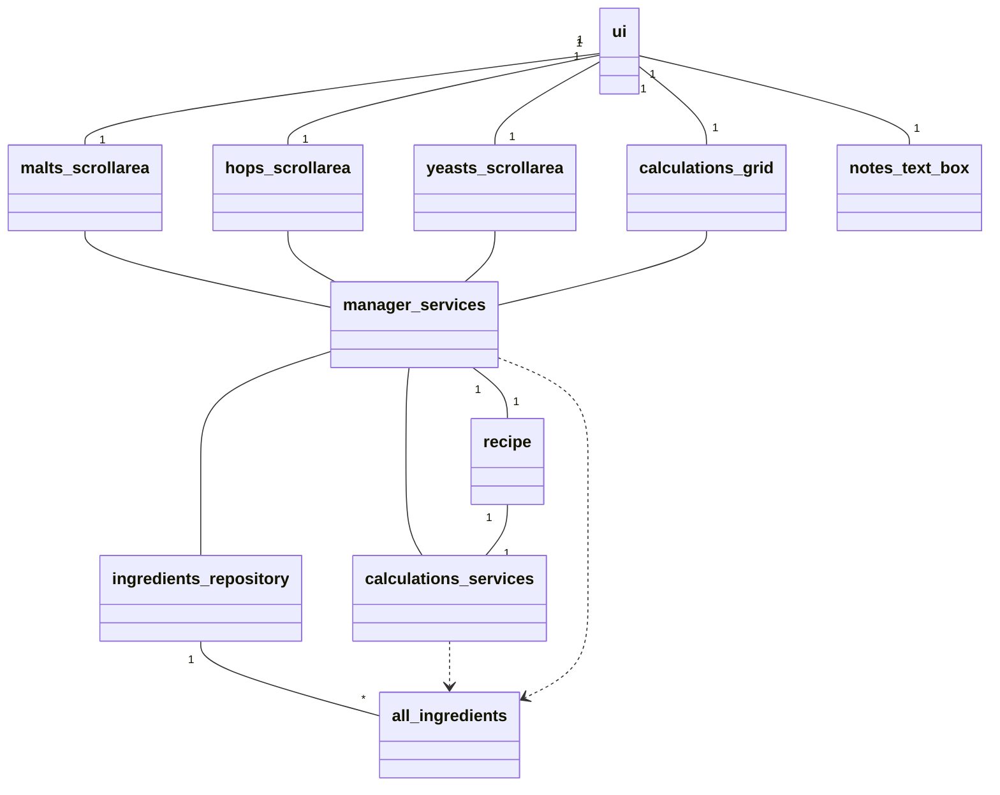
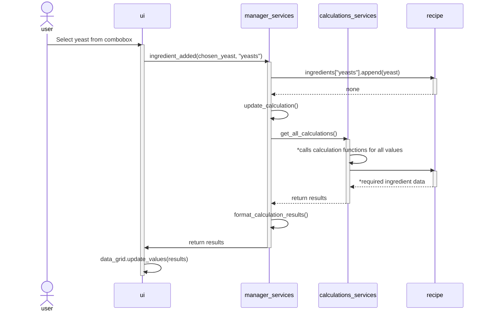
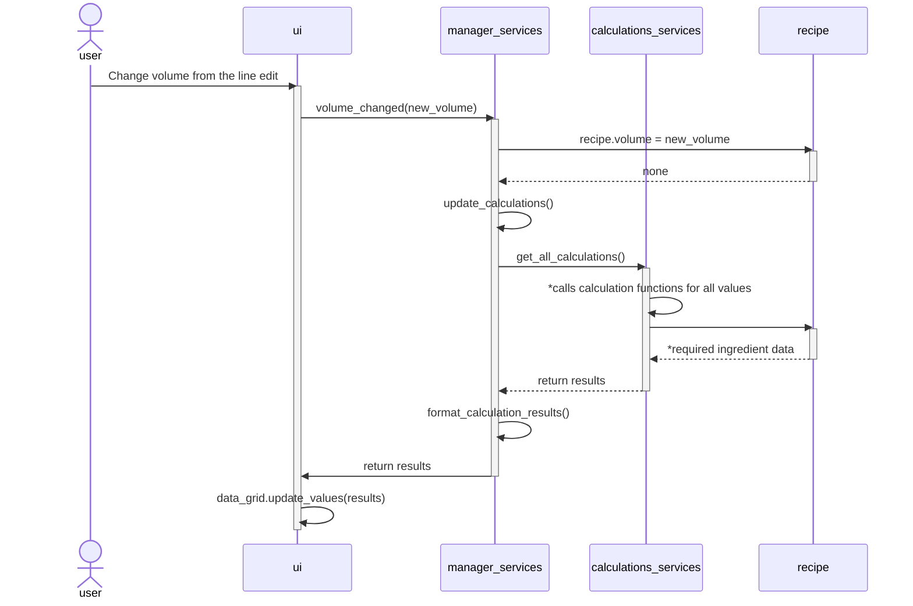

# Architecture

## Application Structure

### Code Package Structure

The ui directory is responsible for the user interface, services handles the application logic and calculations, repositories communicates with the databases, and entities directory defines classes representing ingredients and recipes.

### Class Structure

## Databases

The application has three databases, one for each main ingredient (Malts, Hops, and Yeasts). Each database has its own repository class responsible for retrieving data from the databases. In the future, these classes can be expanded to include features for adding and removing data from the databases.

## Functionalities

Basic functionalities of the application described using sequence diagrams.

### Adding an Ingredient (Yeast) to the Recipe via GUI

### Changing the Recipe Size

*Marked with *: the get_all_calculations function executes all other functions defined in calculations_services and returns their results. Each of these functions retrieves the required data from the recipe object.

### Other Functionalities

As evident from the two previous diagrams, several changes made to the recipe in the application follow a similar pattern. An ingredient is selected and added to the recipe, followed by recalculations and updating of the new data for the user to see.
