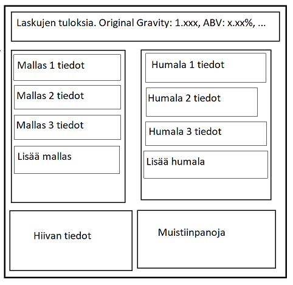

# Requirements Specification

## Purpose of the Application

The purpose of the application is to provide users with a tool for designing various homebrewing recipes. The application allows users to add different ingredients to a selected recipe, and the necessary calculations are performed automatically and displayed to the user.

## Functionality

### Implemented Functionality

- Users can add malts, hops, and yeast to the recipe.
- Users can specify the batch size.
- After each addition, the following default values are calculated and displayed to the user:
  - Original Gravity
  - Final Gravity
  - ABV (Alcohol by Volume)
  - IBU (International Bitterness Units)
  - SRM (Standard Reference Method)
- Users can write separate notes about the recipe.

### Future Planned Functionality

- Ingredient databases
- Recipe saving and loading
- Boil time adjustments
- Improved accuracy for the calculations
- Custom ingredients
- Edit database
  - add/remove ingredients
- UI improvements

## Limitations from the Brewer's Perspective

Several calculations in the application use default values for some variables, which means that the calculations may not always be as precise as possible.

The most significant inaccuracies can be found in the calculation of IBU, where the boiling time of hops cannot currently be adjusted, and the original gravity of the recipe does not affect the calculation of IBU. More information about IBU calculation can be found [here](http://www.highwoodsbrewing.com/ibu.php).

## User Interface Sketch

The final user interface closely resembles the initial sketch. The main difference is the absence of the initial screen. In the current version, the application directly opens the recipe planning window, and there is no functionality for loading or saving recipes.
