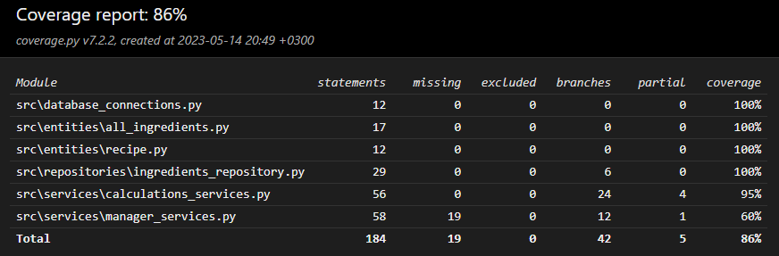

# Testing Document

The software has been tested at the unit and integration levels. Many classes depend on at least the classes in the Entities directory, so unit tests include those at a minimum.

## Test Coverage

The branch coverage is 86% excluding the user interface layer.

## System Testing

System testing has been performed manually.

### Installation

The application has been tested on Windows 10 and Linux environments following the instructions provided in the [user manual](./kayttoohje.md).

### Functionality Testing

The application's functionalities have been tested by providing invalid, empty, and valid values to the input fields. The calculation results of the application may occasionally be inaccurate, but it is not due to any erroneous code in the program. For more information, refer to the "*Limitations from the Brewer's Perspective*" section in the [requirements specification](./vaativuusmaarittely.md).

## Known Bugs in the Application

- When adding ingredients, their default quantity is 0. This quantity remains until the ingredient's amount is updated from the corresponding input field.

## Unexpected Error Situations

- The software assumes that no changes have been made to the files in the */data/* and */src/* directories or that they have not been deleted. The application may crash or produce an error code if modifications have been made to the source code or the files in those directories.
