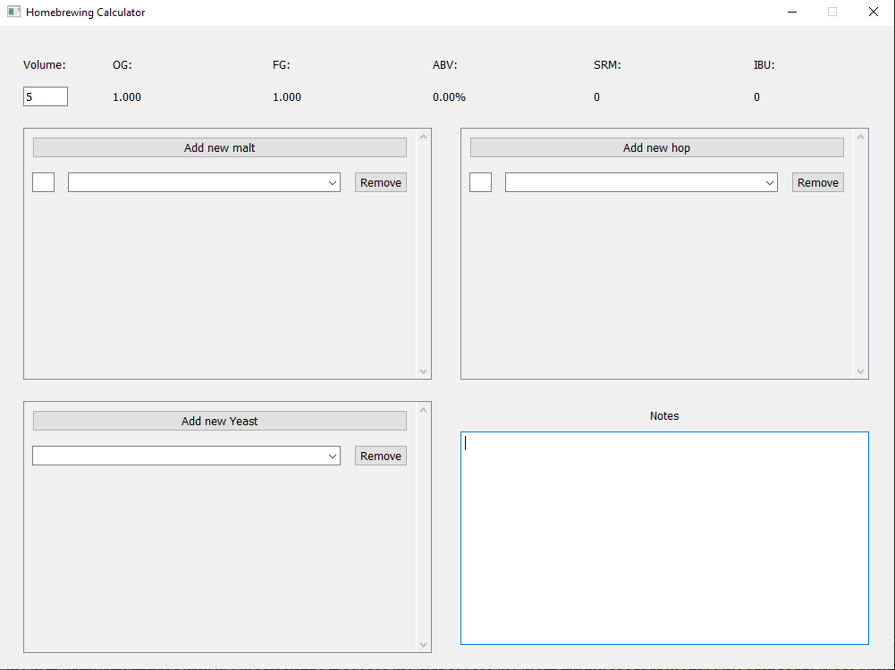
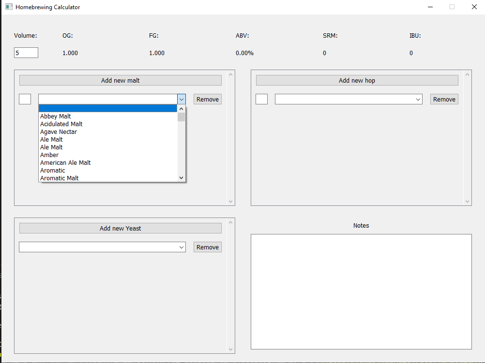
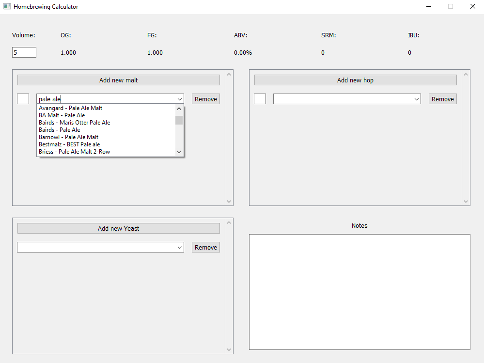
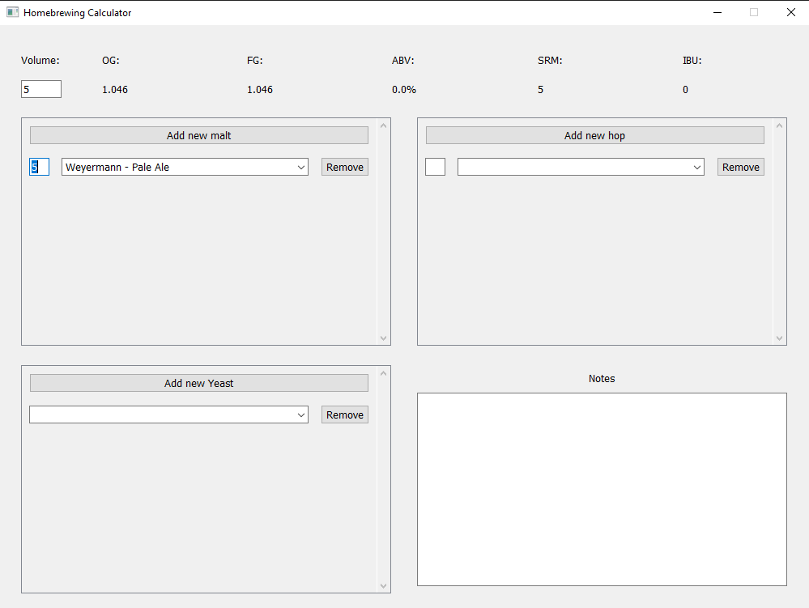
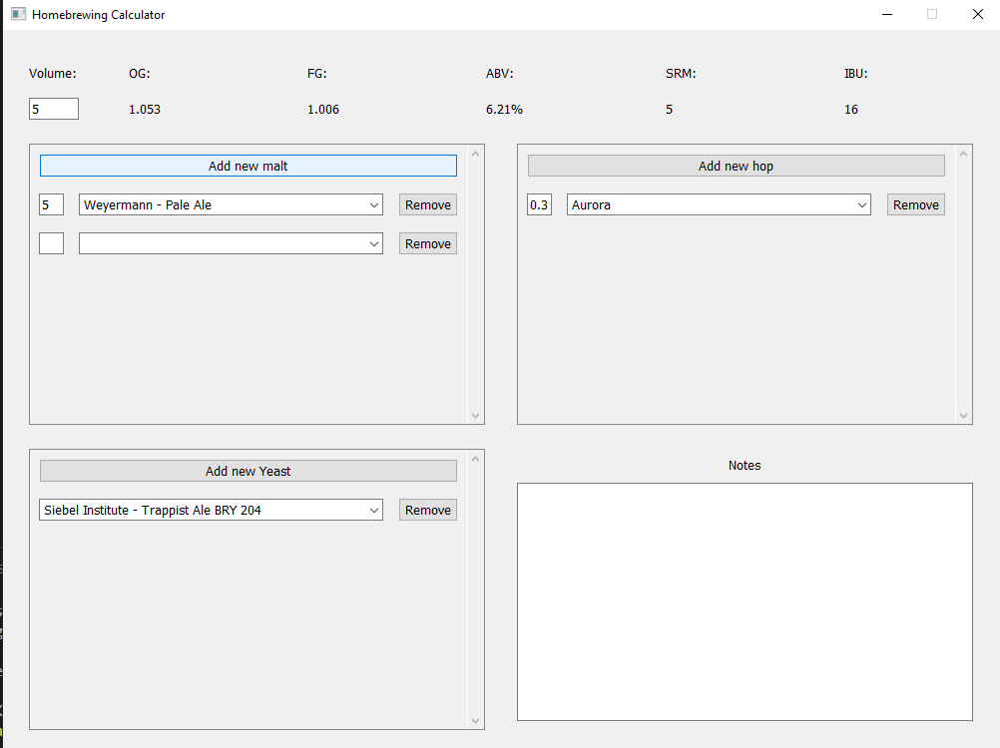
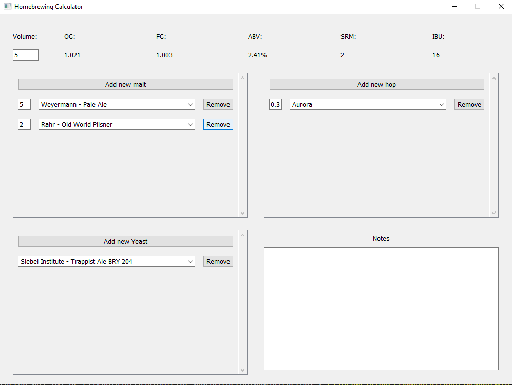
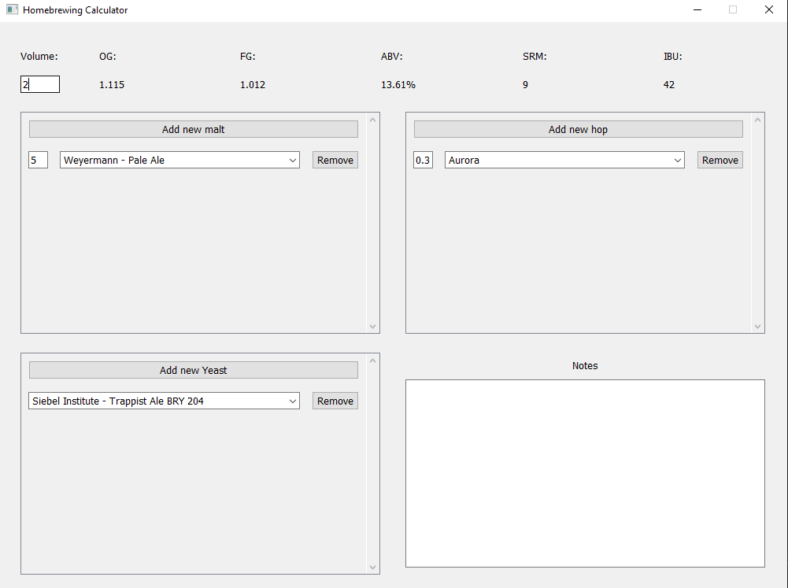

## Starting the Program

On the first run, install the dependencies with the following command:

    poetry install

The program does not require any separate configuration. You can start it directly with the following command:

    poetry run invoke start

## Note

The program will not work if the files inside the */src/* or */data/* directories are deleted or if their names are changed.

## Using the Program

The application opens directly to the recipe design view:

You can add new ingredients to the recipe from the dropdown menus:

You can search for ingredients by typing the name of the ingredient in the dropdown menu:

You can change the quantities of ingredients by entering a new amount in the text field next to the dropdown menu:

You can add new ingredients by clicking the "Add new" button:

You can remove ingredients by clicking the "Remove" button to the right of the dropdown menu:

You can change the size of the recipe by entering a new value in the text field below the "Volume:" heading:

As shown in the images, the calculated values for the recipe update to reflect the new values after each change.